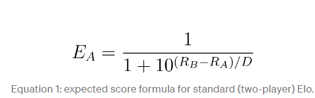
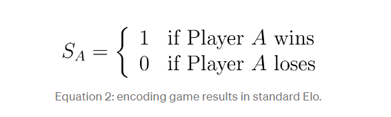
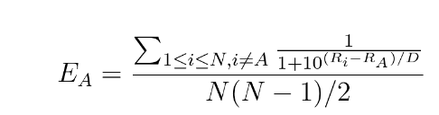

# Elo Rating System Implementation

Implementation of elo system for future use.

The Elo rating system is a method for calculating the relative skill levels of players in two-player games such as chess and Go. It is named after its creator Arpad Elo, a Hungarian-born American physics professor.

The Elo system was invented as an improved chess rating system, but today it is also used in many other games. It is also used as a rating system for multiplayer competition in a number of computer games, and has been adapted to team sports including association football, American college football and basketball, and Major League Baseball.

## How Elo works

Let’s start by understanding how standard Elo works with two players. There are three steps to generating Elo ratings:

1. Expected score: predict the outcome of a game.
2. Actual score: observe the outcome.
3. Update: increase or decrease each player’s rating based on result.

** ELO was invented for only 1v1 matches it does NOT account for multiplayer rating change **

## ELO implementation for 5v5 (or multiplayer games)

Let’s see if we can modify each step of the Elo calculation to accommodate more than two players. We’ll tackle it one step at a time, following the same three steps as standard Elo.

Expected scores
Elo only knows how to compare two players at a time. Let’s reframe our multiplayer game as a combination of pairwise matchups. For example, a game with three players has three distinct matchups (A vs. B, A vs. C, and B vs. C). More generally, a game with N players has N(N-1)/2 distinct pairwise matchups.
Let’s use standard Elo to compute all pairwise expected scores using the formula from the previous section. Then we’ll sum each player’s individual expected scores to get a total expected score for each player. Lastly, we’ll scale the scores so that they sum to 1 across all players (allowing us to interpret the scores as probabilities, like we do in standard Elo). In mathematical terms, our expected score for player A looks like this:

Now for 5v5 we replace `N(N-1)/2` with `5` for each player of `team 1` with every player of `team 2`

## References

1. https://towardsdatascience.com/developing-a-generalized-elo-rating-system-for-multiplayer-games-b9b495e87802